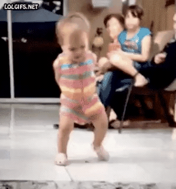

# vid2ani

*Video to GIF/APNG/WEBP converter*



A batch script for converting video files to GIF/APNG/WEBP using FFmpeg.<br>

By MDHEXT, Nabi KaramAliZadeh, Pathduck

## Installation
* Clone the repo.
* Install [FFmpeg](https://www.ffmpeg.org/).
* For Windows make sure that the path to `ffmpeg.exe` is
  [configured in your system environment variables control panel](https://www.wikihow.com/Install-FFmpeg-on-Windows).

## Usage
```
vid2ani [input_file] [arguments]
```
## Arguments
```
-t      Output file type.
        Valid: 'gif' (default), 'png', 'webp'.

-o      Output file.
        The default is the same name as the input video.

-r      Scale or size.
        Width of the animation in pixels.
        The default is the same scale as the original video.

-s      Start time of the animation (HH:MM:SS.MS)

-e      End time of the animation (HH:MM:SS.MS)

-f      Framerate in frames per second.
        The default is 15.

-d      Dithering algorithm to be used.
        The default is 0 (None).

-b      Bayer Scale setting.
        This can only be used when Bayer dithering is applied.
        Range 0 - 5, default is 2.

-m      Palettegen mode - one of 3 modes listed below.
        The default is 1 (diff).

-c      The maximum amount of colors useable per palette.
        Range 3 - 256 (default)

-k      Enables paletteuse error diffusion.

-l      Enable lossy WebP compression and quality.
        The default for WebP is lossless.
        Range 0 - 100, default 75.

-v      Set FFmpeg log level, for troubleshooting.
        The default log level is 'error'

-p      Opens the resulting animation in your default Photo Viewer.

Dithering Modes:
0: None
1: Bayer
2: Heckbert
3: Floyd Steinberg
4: Sierra2
5: Sierra2_4a
6: sierra3
7: burkes
8: atkinson

Palettegen Modes:
1: diff - only what moves affects the palette
2: single - one palette per frame
3: full - one palette for the whole animation

About Bayerscale:
When bayer dithering is selected, the Bayer Scale option defines the
scale of the pattern (how much the crosshatch pattern is visible).
A low value means more visible pattern for less banding, a higher value
means less visible pattern at the cost of more banding.
```

## Examples
```
  vid2ani sample.mp4
  vid2ani sample.mp4 -t png
  vid2ani sample.mp4 -t webp -l 50
  vid2ani sample.mp4 -f 20 -r 450
  vid2ani sample.mp4 -s 5:40 -e 5:45
  vid2ani sample.mp4 -o babydance -m 2 -k -b 3
```

## Notes

* As APNG does not support multiple input palettes, palettegen (-m) will
fall back to using diff mode if single mode is selected.
* For WEBP lossy (-l) encoding, the quality parameter is mandatory.
* This tool uses ffmpeg, you can download that here: [FFmpeg](https://www.ffmpeg.org/)
* You can download this fork from here: [Pathduck/vid2ani](https://github.com/Pathduck/vid2ani)
* You can download the original release here: [MDHEXT/video2gif](https://github.com/MDHEXT/video2gif)<br>
* This tool wouldn't be possible without the research listed here: [High quality GIF with FFmpeg](https://blog.pkh.me/p/21-high-quality-gif-with-ffmpeg.html)<br>
